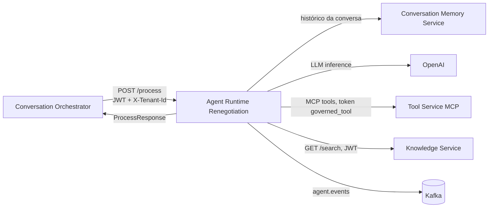

# Agent Runtime Renegotiation

Runtime de agente de IA para jornada de renegociação de dívidas via canais conversacionais, como WhatsApp.

Este serviço recebe uma solicitação do `conversation-orchestrator`, executa um agente com OpenAI via Strands Agents, consulta ferramentas MCP e base de conhecimento quando necessário, retorna uma decisão estruturada e publica evento de processamento no Kafka.

## Visão geral



## Stack

- Python 3.12
- FastAPI
- Uvicorn
- Strands Agents
- OpenAI
- MCP client
- HTTPX
- Tenacity
- Confluent Kafka
- PyJWT (assinatura de tokens internos por chamada)
- Pytest

## Responsabilidades

- Receber contexto da conversa via `POST /process`, autenticado com JWT interno.
- Buscar histórico recente da conversa no Conversation Memory Service antes de montar o prompt (degrada para histórico vazio se o serviço estiver indisponível).
- Montar prompt com mensagem do cliente, estágio da jornada, última intenção e histórico.
- Executar agente especializado em renegociação de dívidas.
- Consultar ferramentas MCP do Tool Service, assinando um token `governed_tool` por chamada com o estágio/versão da jornada atual.
- Consultar base de conhecimento de FAQ, políticas e regras de negócio.
- Retornar decisão estruturada para o orquestrador.
- Forçar handoff quando houver baixa confiança ou falha no runtime/modelo.
- Publicar evento `agent.events` no Kafka, incluindo `tenant_id`.

## Endpoint

### `POST /process`

Contrato usado pelo `conversation-orchestrator`.

Headers obrigatórios:

```http
Authorization: Bearer <jwt-interno>
X-Tenant-Id: <tenant>
```

#### Request

> O contrato usa nomes em PascalCase para compatibilidade com serialização padrão do `.NET System.Text.Json`.

```json
{
  "TenantId": "00000000-0000-0000-0000-000000000001",
  "ConversationId": "conv-001",
  "MessageId": "wamid.001",
  "MessageType": "Text",
  "Text": "Quero renegociar minha dívida",
  "JourneyStage": "initial",
  "JourneyVersion": 0,
  "LastIntent": null,
  "ExplicitConfirmationMessageId": null
}
```

#### Response

```json
{
  "Intent": "renegotiation_request",
  "Confidence": 0.92,
  "ReplyText": "Posso te ajudar com a renegociação. Vou consultar as opções disponíveis para você.",
  "RequiresHandoff": false,
  "HandoffReason": null
}
```

#### Campos principais

| Campo | Direção | Descrição |
|---|---|---|
| `TenantId` | Request | Tenant da conversa; precisa bater com a claim assinada no JWT (senão `400`). |
| `ConversationId` | Request | Identificador da conversa. |
| `MessageId` | Request | Identificador da mensagem atual; usado para assinar os tokens `governed_tool` enviados ao Tool Service. |
| `MessageType` | Request | Tipo da mensagem recebido pelo canal. |
| `Text` | Request | Texto enviado pelo cliente. |
| `JourneyStage` | Request | Estágio atual da jornada conversacional; assinado nos tokens `governed_tool` para autorizar (ou negar) as tools chamadas nesse turno. |
| `JourneyVersion` | Request | Versão da jornada no momento do turno. |
| `LastIntent` | Request | Última intenção identificada anteriormente. |
| `ExplicitConfirmationMessageId` | Request | Preenchido pelo Orchestrator quando a mensagem atual é uma confirmação explícita; exigido pela tool `confirmar_acordo`. |
| `Intent` | Response | Intenção identificada pelo agente. |
| `Confidence` | Response | Confiança da decisão. |
| `ReplyText` | Response | Resposta sugerida para envio ao cliente. |
| `RequiresHandoff` | Response | Indica transferência para atendimento humano. |
| `HandoffReason` | Response | Motivo do handoff. |

Respostas de erro: `400` se `X-Tenant-Id`/claim/`TenantId` do payload não baterem; `401` sem JWT válido; `422` se campos obrigatórios do payload faltarem.

### `GET /health/live`, `GET /health/ready`

`/health/ready` verifica a chave de assinatura JWT interna.

## Regras de decisão

- O agente deve responder de forma estruturada usando o schema `AgentDecision`.
- Se a inferência falhar, o serviço retorna `RequiresHandoff = true` com motivo `agent_runtime_unavailable`.
- Se a confiança ficar abaixo do threshold configurado, o serviço força `RequiresHandoff = true` com motivo `low_confidence`.
- O agente não deve inventar valores, prazos ou condições de renegociação; deve usar ferramentas disponíveis.
- A formalização de acordo exige confirmação explícita do cliente.

## Eventos Kafka

### Tópico: `agent.events`

Publicado após o processamento da mensagem.

```json
{
  "conversation_id": "conv-001",
  "intent": "renegotiation_request",
  "confidence": 0.92,
  "requires_handoff": false,
  "handoff_reason": null
}
```

A publicação Kafka não quebra o endpoint em caso de erro; falhas são registradas em log.

## Configuração

O serviço usa `pydantic-settings`, com suporte a variáveis de ambiente.

| Variável | Default | Descrição |
|---|---:|---|
| `OPENAI_API_KEY` | (vazio) | Chave de API da OpenAI. Obrigatória com `MOCK_AGENT_ENABLED=false`. |
| `OPENAI_MODEL_ID` | `gpt-4o-mini` | Modelo usado na OpenAI. |
| `TOOL_SERVICE_MCP_URL` | `http://localhost:8400/mcp` | Endpoint MCP do Tool Service. |
| `KNOWLEDGE_SERVICE_BASE_URL` | `http://localhost:8500` | Base URL do Knowledge Service. |
| `KNOWLEDGE_SERVICE_RETRY_ATTEMPTS` | `2` | Tentativas adicionais para busca na base de conhecimento. |
| `KAFKA_BOOTSTRAP_SERVERS` | `localhost:29092` | Bootstrap servers do Kafka. |
| `KAFKA_AGENT_EVENTS_TOPIC` | `agent.events` | Tópico de eventos do agente. |
| `CONFIDENCE_THRESHOLD` | `0.6` | Confiança mínima antes de forçar handoff. |
| `CONVERSATION_MEMORY_SERVICE_BASE_URL` | `http://localhost:8600` | Base URL do Conversation Memory Service, usado para buscar histórico recente. |
| `CONVERSATION_MEMORY_HISTORY_LIMIT` | `10` | Quantidade de mensagens de histórico buscadas por turno. |
| `INTERNAL_AUTH_ENABLED` | `true` | Se `false`, `/process` não exige JWT (uso local/teste). |
| `INTERNAL_AUTH_SIGNING_KEY` | (vazio) | Chave HS256 usada para validar o JWT recebido e assinar os tokens enviados ao Tool Service/Knowledge Service/Memory Service. Obrigatória com auth habilitada. |

Exemplo:

```bash
export OPENAI_API_KEY="sk-..."
export OPENAI_MODEL_ID="gpt-4o-mini"
export TOOL_SERVICE_MCP_URL="http://localhost:8400/mcp"
export KNOWLEDGE_SERVICE_BASE_URL="http://localhost:8500"
export CONVERSATION_MEMORY_SERVICE_BASE_URL="http://localhost:8600"
export KAFKA_BOOTSTRAP_SERVERS="localhost:29092"
export INTERNAL_AUTH_SIGNING_KEY="<segredo-com-pelo-menos-32-bytes>"
```

## Como executar localmente

### Pré-requisitos

- Python 3.12
- Chave de API da OpenAI (ou `MOCK_AGENT_ENABLED=true` pra testar sem uma)
- Kafka local em `localhost:29092`
- Tool Service MCP disponível ou indisponível de forma tolerada
- Knowledge Service disponível em `localhost:8500`
- Conversation Memory Service disponível em `localhost:8600` (degrada para histórico vazio se indisponível)
- `INTERNAL_AUTH_SIGNING_KEY` com pelo menos 32 bytes, igual ao configurado nos serviços chamados

### Criar ambiente virtual

```bash
python -m venv .venv
```

Ativar no Windows:

```bash
.venv\Scripts\activate
```

Ativar no Linux/macOS:

```bash
source .venv/bin/activate
```

### Instalar dependências

```bash
pip install -r requirements.txt
```

Para desenvolvimento e testes:

```bash
pip install -r requirements-dev.txt
```

### Subir API

```bash
uvicorn app.main:app --host 0.0.0.0 --port 8100 --reload
```

Swagger:

```text
http://localhost:8100/docs
```

## Teste rápido

```bash
curl -X POST http://localhost:8100/process \
  -H "Content-Type: application/json" \
  -d '{
    "ConversationId": "conv-001",
    "MessageType": "Text",
    "Text": "Quero renegociar minha dívida",
    "JourneyStage": "initial",
    "LastIntent": null
  }'
```

## Testes

```bash
python -m pytest
```

> Use `python -m pytest`, não o script `pytest` isolado — sem o `python -m`, o diretório do projeto não entra no `sys.path` e a suíte inteira falha com `ModuleNotFoundError: No module named 'app'` (é exatamente por isso que o workflow de CI usa `python -m pytest`).

O `pyproject.toml` já aponta os testes para a pasta `tests` e configura `asyncio_mode = auto`.

## CI

`.github/workflows/ci.yml` roda `pip install`/`python -m pytest` a cada push/PR para `master`.

## Estrutura

```text
.
├── app
│   ├── agent
│   │   ├── core.py
│   │   └── prompts.py
│   ├── context
│   │   └── history.py
│   ├── events
│   │   └── publisher.py
│   ├── tools
│   │   ├── knowledge.py
│   │   └── tool_service.py
│   ├── config.py
│   ├── logging_setup.py
│   ├── main.py
│   ├── models.py
│   └── platform.py
├── tests
│   ├── agent
│   ├── context
│   ├── events
│   └── tools
├── requirements.txt
├── requirements-dev.txt
├── pyproject.toml
├── Dockerfile
├── .github/workflows/ci.yml
└── agent-runtime-renegotiation.pyproj
```

## Integrações

### Conversation Orchestrator

Chama `POST /process` enviando contexto da conversa e espera um `ProcessResponse` com intenção, confiança, resposta e decisão de handoff.

### OpenAI

Usado pelo Strands Agents via `OpenAIModel`.

### Tool Service MCP

Fornece ferramentas de negócio para consultar elegibilidade, débitos, simulações e formalização. Se a conexão falhar, o agente segue sem essas tools e registra warning.

### Knowledge Service

Exposto via `GET /search?query=...`, usado para buscar FAQ, políticas e regras de renegociação. Chamada assinada com JWT.

### Conversation Memory Service

Exposto via `GET /conversations/{conversation_id}/messages`, usado para buscar as últimas `CONVERSATION_MEMORY_HISTORY_LIMIT` mensagens antes de montar o prompt. Chamada assinada com JWT; falha degrada para histórico vazio, não derruba a requisição.

### Kafka

Recebe o evento `agent.events` com o resultado da decisão do agente, incluindo `tenant_id`.

## Observações técnicas

- O runtime é stateless; o estado conversacional vem do orquestrador (e do histórico buscado no Memory Service a cada turno).
- O contrato HTTP usa aliases PascalCase por compatibilidade com .NET.
- Falhas no Tool Service MCP, no Knowledge Service e no Memory Service não derrubam a requisição.
- Falhas no Kafka não derrubam a requisição.
- Baixa confiança força handoff humano.
- `journey_stage`/`journey_version`/`message_id` são assinados uma única vez no início do turno e usados para todas as chamadas de tool desse turno — uma tool que exigir um estágio mais avançado do que o assinado no início do turno será negada mesmo que uma tool anterior no mesmo turno "deveria" ter avançado a jornada (ver `tool-service-renegotiation`, política `consultar_contratos`).

## Próximos passos sugeridos

- Documentar contrato MCP das ferramentas de renegociação.
- Adicionar exemplos de respostas por intenção.
- Lint e security scan no CI (hoje o workflow só roda a suíte de testes).
